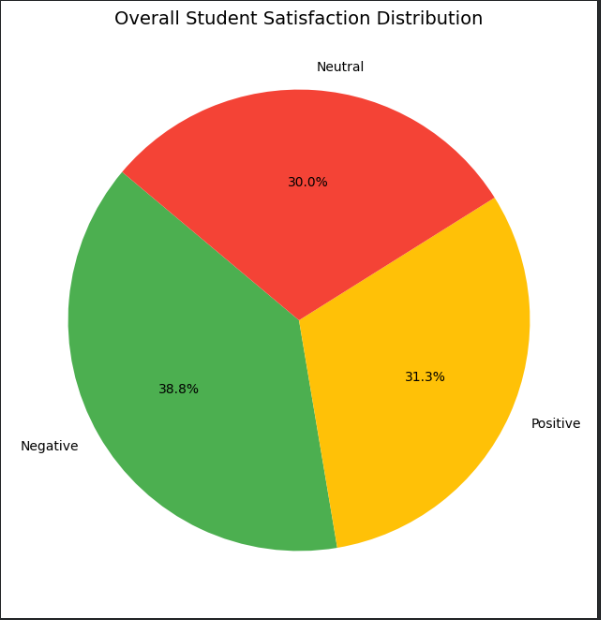
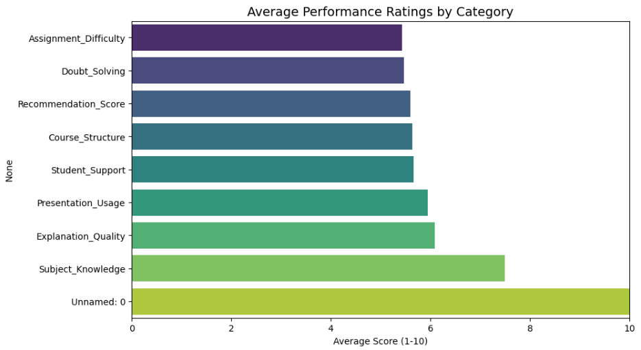
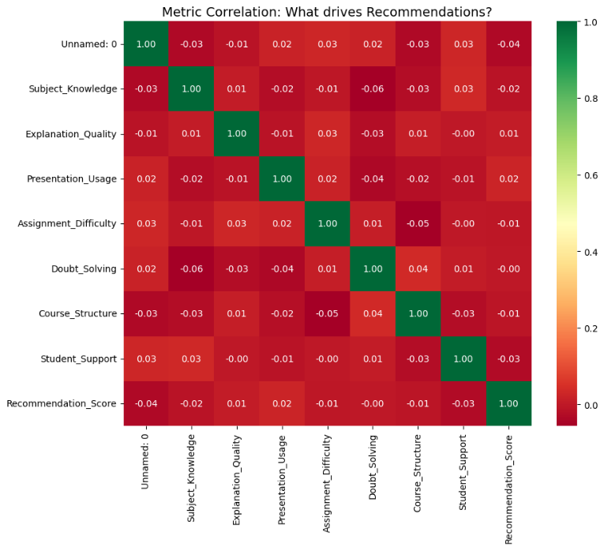

# FUTURE_DS_03

Analyzing student feedback using Python and NLP to improve campus events.
# 📊 College Event Feedback Analysis
*Internship Project - Task 3*

## 🚀 Project Overview
This project analyzes student satisfaction data from campus events. I used Python to transform raw numerical ratings into actionable insights.

## 📈 Visual Insights

### 1. Overall Satisfaction Breakdown
This chart shows the distribution of student sentiment based on their likelihood to recommend the course.

### 2. Performance by Category
This bar chart identifies our strongest areas (Subject Knowledge) and areas needing improvement (Assignment Difficulty).

### 3. Correlation Heatmap
This heatmap reveals which teaching factors actually drive student recommendations.

## 💡 Key Recommendations
- **Improve Assignment Clarity:** Assignments were the lowest-rated area (Avg: 5.4/10).
- **Focus on Doubt Solving:** Increasing interaction time will help convert "Neutral" students to "Positive."
